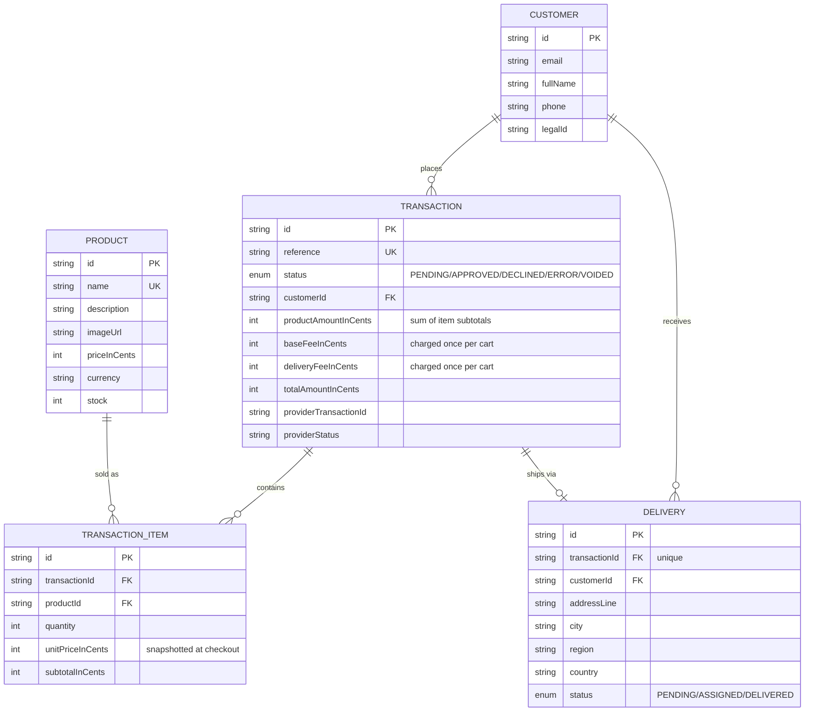

# Checkout Payments App

A mobile-first checkout SPA (React + Redux) backed by a NestJS API, built around Hexagonal
Architecture / Ports & Adapters and Railway Oriented Programming, integrating a real payment
provider's sandbox end to end: browse products, pay with a tokenized card, and watch stock
settle live.

**Live**: [checkout-app-503917.web.app](https://checkout-app-503917.web.app) · API:
[checkout-api-grnxwqyaaq-uc.a.run.app/api/products](https://checkout-api-grnxwqyaaq-uc.a.run.app/api/products)
· [Swagger](https://checkout-api-grnxwqyaaq-uc.a.run.app/docs)

## Stack

- **Frontend**: React + TypeScript, Vite, Redux Toolkit + `redux-persist`, React Router,
  react-hook-form + Zod, CSS Modules, Jest + React Testing Library.
- **Backend**: NestJS + TypeScript, Prisma + PostgreSQL, `neverthrow` for Railway Oriented
  Programming, Zod (`nestjs-zod`) for validation and OpenAPI generation, Jest.
- **Shared**: `packages/contracts` — Zod schemas as the single source of truth for request/response
  shapes, consumed by both apps.
- **Deployment**: Google Cloud Run (API, Docker) + Firebase Hosting (SPA), Neon Postgres, GitHub
  Actions authenticating via Workload Identity Federation (no long-lived cloud keys in CI).

## Repository layout

```
apps/
  api/           NestJS backend (one hexagon per bounded context: domain / application / infrastructure)
  web/           React SPA
packages/
  contracts/     Shared Zod schemas + inferred TypeScript types
infra/           One-time GCP setup script (Workload Identity Federation) + deployment docs
docs/postman/    Postman collection exported from the live OpenAPI document
```

## Prerequisites

- Node.js 22+
- Docker (for local PostgreSQL)

## Getting started

```bash
npm install
docker compose up -d db
cp .env.example .env

npm run db:deploy -w @checkout/api   # applies committed migrations
npm run db:seed -w @checkout/api

npm run dev:api   # http://localhost:3000/api, Swagger at /docs
npm run dev:web   # http://localhost:5173
```

`.env.example` documents every variable, including a sandbox payment-provider key quartet —
register at the provider's merchant portal for your own, or use the ones already deployed to
production (referenced in the GitHub Actions secrets, not in this file).

## Testing

```bash
npm run test:cov   # runs both apps' Jest suites with the 80% coverage gate enforced
```

Current coverage (`npm run test:cov`, both green against the 80% gate):

| | Statements | Branches | Functions | Lines | Tests |
|---|---|---|---|---|---|
| **API** (`@checkout/api`) | 99.61% | 97.05% | 99.09% | 99.57% | 141 |
| **Web** (`@checkout/web`) | 95.91% | 90.25% | 94.59% | 96.92% | 138 |

## Architecture

### Hexagonal (Ports & Adapters), one hexagon per bounded context

`apps/api/src` has one folder per bounded context (`products`, `customers`, `deliveries`,
`transactions`, `payments`), each split into:

- **`domain/`** — entities and value objects with no framework dependency (e.g. `Product.hasStockFor()`,
  `Transaction`'s status transitions, the flat fee constants).
- **`application/`** — use cases that orchestrate domain + ports (e.g.
  `CreateCheckoutTransactionUseCase`, `ReconcileTransactionUseCase`), expressed as
  `Result<T, DomainError>` chains (Railway Oriented Programming via `neverthrow` — expected
  failures like "insufficient stock" or "transaction not found" are values, not exceptions; a
  single `domain-error.mapper.ts` translates them to HTTP status codes at the edge).
- **`infrastructure/`** — adapters: Prisma repositories implementing the domain's repository
  ports, NestJS controllers, and (for `payments`) the real HTTP adapter to the payment
  provider's API implementing the `PaymentGateway` port.

The only building block shared across contexts is a small `UnitOfWork` port
(`shared/domain/unit-of-work.ts`) wrapping `prisma.$transaction`, so the checkout use case can
write Customer + Delivery + Transaction atomically without leaking Prisma into the application
layer. The port is `Result`-aware rather than a bare `Promise`: a domain `Err` returned mid-pipeline
is rethrown as a sentinel so `prisma.$transaction` actually rolls back, then unwrapped back into an
`Err` outside the transaction — a resolved-but-failed value would otherwise be indistinguishable
from success to the underlying driver, and Prisma would commit the partial write.

### Checkout flow

A checkout is a **cart of line items**, not a single product: one transaction can hold any number
of distinct products, and the flat fees below are charged once per transaction regardless of how
many line items it contains.

1. **`POST /api/transactions`** — takes `items: [{ productId, quantity }]` (1–20 distinct
   products, no duplicates), validates `stock >= quantity` per line (rejected upfront, no
   reservation), computes fees (flat 5,000 COP base fee + 8,000 COP delivery fee, charged once
   for the whole cart), finds-or-creates the Customer by email, and creates a `PENDING`
   Transaction + its `TransactionItem` line items + Delivery atomically. Each line snapshots
   `unitPriceInCents` at checkout time, so a later catalogue price change never rewrites a past
   order's total. `reference` is the transaction's own UUID (globally unique, as the provider
   requires).
2. **`POST /api/transactions/:id/payment`** — takes a card token (tokenized directly
   browser → the provider with the *public* key; our API never sees a PAN), fetches the
   provider's acceptance token, computes the integrity signature server-side
   (`SHA256(reference + amount_in_cents + currency + integrity_secret)` — the secret never
   reaches the browser), and charges the card with the *private* key.
3. **`GET /api/transactions/:id`** — reconciles on read: if still `PENDING`, polls the
   provider's status and applies a settled outcome exactly once (status update, delivery assignment,
   conditional stock decrement via `UPDATE ... WHERE stock >= quantity` per line so it can never
   go negative). If the payment is approved but one or more lines have since run out of stock,
   the transaction stays `APPROVED` (the card was already charged) and `failureReason` names the
   short line(s) instead of the transaction being rolled back or marked as failed — the delivery
   itself is left `PENDING` so nothing unshippable gets marked ready. The frontend's status
   screen polls this endpoint until it settles.

### Frontend

Products are added to a **cart** (`features/cart`) before checkout — the cart itself is a routed
background-location overlay at `/cart` (a header button with an item-count badge opens it), and
the checkout modal at `/checkout/details`, `/summary`, `/status` follows once the customer
continues. Both reuse the same Modal/Backdrop layered over the still-mounted product page via
React Router's background-location pattern — deep-linkable and refresh-resilient. The cart
persists across a refresh (it's rehydrated like the rest of checkout state) and is only cleared
once a payment is genuinely `APPROVED`, so a declined card leaves it intact to retry. The card
token lives only in local component state (`CardDeliveryForm`), never Redux, never
`localStorage`.

## Security

An OWASP-alignment pass (iteration 7) covered:

- **Rate limiting** (`@nestjs/throttler`): a global 60 req/min default, tightened to 10/min on
  transaction creation and 5/min on payment submission to blunt stock-spam and card-testing
  abuse. The API trusts exactly one proxy hop (`trust proxy: 1`) so limits key on the real
  client IP behind Cloud Run's load balancer, not the LB's own address.
- **Security headers**: Helmet on the API (CSP, HSTS, `X-Content-Type-Options`, etc.); Firebase
  Hosting headers on the web app (CSP, HSTS with `preload`, `X-Frame-Options: DENY`,
  `Referrer-Policy`). The web app's CSP `connect-src` is pinned to the exact deployed API origin
  at deploy time (not a wildcard `*.run.app`) once the Cloud Run URL is resolved in CI. CORS is
  scoped to the exact web origin with `credentials` left off, since the app has no
  cookies/sessions anywhere.
- **Dependency audit**: `npm audit` flagged 47 findings after adding the rate limiter; patched
  `express`, `body-parser`, `qs`, `js-yaml`, and `lodash` to fixed versions via npm `overrides`,
  clearing everything fixable. The production Docker image's remaining findings (multer/`file-type`
  DoS advisories, an `@nestjs/core` SSE-injection CVE) only affect file-upload or SSE features
  this app doesn't use anywhere in its routes — confirmed by grep, not assumed — and have no
  non-major fix available upstream, so they're accepted as documented, non-exploitable risk
  rather than forcing a disruptive NestJS v11 migration. `react-router-dom`'s open-redirect CVEs
  are similarly accepted: no `navigate()`/`<Link>` call anywhere in the codebase takes a
  user-controlled destination (all are hardcoded route literals), so the vulnerable code path has
  no way to be reached, and no patched 6.x release exists (only a v7 major).

## API documentation

- **Swagger**: served at `/docs` (locally or on the [deployed API](https://checkout-api-grnxwqyaaq-uc.a.run.app/docs)),
  generated from the same Zod contracts used for request validation. Note that zod `.refine`
  rules — like `items` needing 1–20 entries with no duplicate `productId` — don't surface in the
  generated OpenAPI schema (only `.min`/`.max`/base types do); they're still enforced at request
  time, just not self-documenting in Swagger.
- **Postman**: [`docs/postman/checkout-payments-api.postman_collection.json`](docs/postman/checkout-payments-api.postman_collection.json),
  exported straight from the live OpenAPI document — see [`docs/postman/README.md`](docs/postman/README.md)
  for import instructions and how to regenerate it.

## Data model



Source of truth: [`apps/api/prisma/schema.prisma`](apps/api/prisma/schema.prisma).

## Deployment

**API**: NestJS as a plain Docker container on **Cloud Run**. **Web**: the React SPA on
**Firebase Hosting**. **CI/CD**: `.github/workflows/deploy.yml` runs on every merge to `main`,
authenticating via Workload Identity Federation — no long-lived GCP keys stored anywhere. It
builds and pushes the API's Docker image, deploys it to Cloud Run, runs Prisma migrations +
the idempotent seed script against Neon, then builds and deploys the web app against the live
API URL.

See [`infra/README.md`](infra/README.md) for the one-time setup script and full pipeline
details, including a note on why this project moved from an initial AWS (Lambda + CloudFront)
deployment to GCP mid-iteration.

## Known trade-offs

- **Stock race window**: stock is validated per line at `PENDING` creation (reject upfront, no
  reservation) and decremented only on `APPROVED` via a conditional `UPDATE ... WHERE
  stock >= quantity`, so it can never go negative — but a narrow race window remains on the very
  last unit between two concurrent pending payments. Acceptable for this scope; a real
  inventory-reservation system would close it.
- **Partial fulfilment on a multi-item cart**: if a payment is approved but stock for one or more
  lines has since sold out (the race window above), the transaction is deliberately left
  `APPROVED` with `failureReason` naming the short product(s), rather than rolled back or marked
  `ERROR` — the customer has already been charged, so pretending otherwise would misrepresent a
  successful payment. Whatever stock the settlement did manage to reserve is left reserved rather
  than released, since the customer paid for those units. Fulfilling the remainder (partial
  refund vs. restock-and-ship) is an operational decision this app surfaces but doesn't automate.
- **Cross-browser testing**: verified in Chrome across mobile/tablet/desktop breakpoints (the
  grid collapses to one column below 480px, form rows stack below 480px). Firefox/Safari engine
  testing wasn't performed (tooling constraint, not a code concern) — the app uses no
  experimental CSS/JS APIs; its only vendor-prefixed rules (`-webkit-line-clamp`,
  `-webkit-font-smoothing`) are the de-facto cross-browser idioms supported by all evergreen
  engines.
